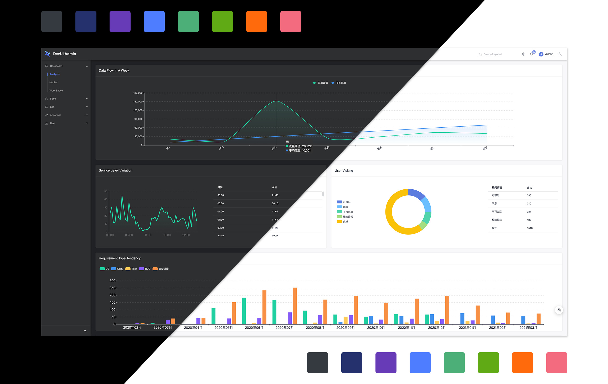

<p align="center"><a href="https://devui.design/admin-page/home" target="_blank" rel="noopener noreferrer">
</p>
<p align="center">
  <a href="https://github.com/DevCloudFE/ng-devui-admin"></a>
  <a href="https://angular.io/"></a>
  <a href="https://opensource.org/licenses/MIT"></a>
</br>
  <a href="README.md"></a>
  <a href="README_zh_CN.md"></a>
  <a href="https://www.npmjs.com/package/ng-devui-admin"></a>
  <a href="https://gitter.im/devui-design/devui-design"></a>
</p>

<h1 align="center">DevUI Admin</h1>
DevUI Admin 是一个企业级中后台前端/设计解决方案，依据 DevUI Design 设计价值观，我们在自身的设计规范和基础组件的基础上，构建出了后台管理模板 DevUI Admin。

&nbsp;


- 预览：https://devui.design/admin/
- 首页：https://devui.design/admin-page/home
- 文档：https://devui.design/admin-page/docs/getting-started
- Admin 区块: https://devui.design/admin-materials/

## 特性


- 响应式：适应不同屏幕大小，为用户提供更舒适的界面与用户体验
- 个性化主题：支持多种主题风格与个性化配置动态切换
- 布局：页面布局可配置，灵活布局
- Mock 数据：本地数据调试方案，前后端分离
- 国际化：实现国际化功能，满足多语言业务诉求
- 功能丰富：基于 DevUI 实践与沉淀，提炼了典型的业务场景并提供场景丰富的组件库

## 使用

```bash
ng new your-project && cd your-project  # 创建选项：非严格模式 & SCSS
ng add ng-devui-admin

npm start # open http://localhost:4200
```

更多的使用信息请参考：[使用文档](https://devui.design/admin-page/docs/getting-started)

## 贡献

欢迎贡献您的代码或者讨论您的好点子！

在提出 pull request 之前，请确保您阅读了我们的[贡献指南](./CONTRIBUTING_zh_CN.md)

感谢所有帮助我们构建 DevUI Admin 的贡献者

## 支持

支持现代浏览器

| [](http://godban.github.io/browsers-support-badges/)</br>Edge | [](http://godban.github.io/browsers-support-badges/)</br>Firefox | [](http://godban.github.io/browsers-support-badges/)</br>Chrome | [](http://godban.github.io/browsers-support-badges/)</br>Safari | [](http://godban.github.io/browsers-support-badges/)</br>Opera |
| ---------------------------------------------------------------------------------------------------------------------------------------------------------------------------------------------------------- | ----------------------------------------------------------------------------------------------------------------------------------------------------------------------------------------------------------------- | ------------------------------------------------------------------------------------------------------------------------------------------------------------------------------------------------------------- | ------------------------------------------------------------------------------------------------------------------------------------------------------------------------------------------------------------- | --------------------------------------------------------------------------------------------------------------------------------------------------------------------------------------------------------- |
| Edge                                                                                                                                                                                                       | last 2 versions                                                                                                                                                                                                   | last 2 versions                                                                                                                                                                                               | last 2 versions                                                                                                                                                                                               | last 2 versions                                                                                                                                                                                           |

## LICENSE

[**MIT**](https://opensource.org/licenses/MIT)
