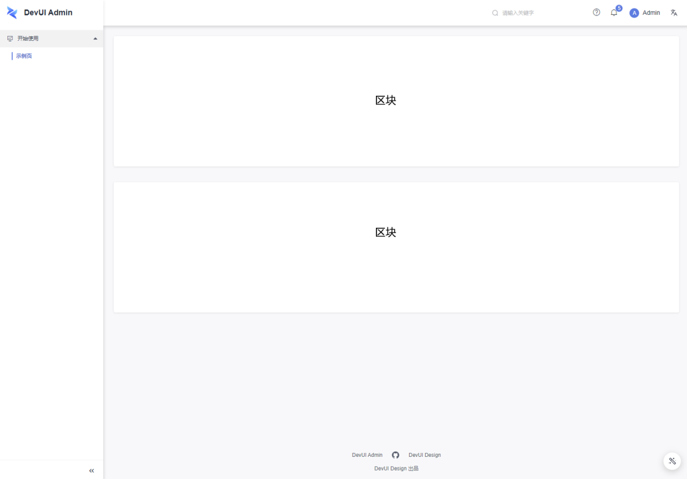

# 概述

在 `Admin` 中，外层项目框架的下层，即为我们的页面。`Admin` 提供的示例页面中，每一页面均可被划分为一个或多个区块，我们将这些示例页面中提供的区块，进行拆分与汇总形成区块库。利用当前区块库，你可选取你需要的区块进行页面搭建，进一步提升页面搭建效率。所有区块均可在代码级别进行扩展，在使用后你可最大限度自定义它们。

更多地，现在我们支持使用 `Admin Cli` 进行区块的使用，使用 `Admin Cli`，你只需几个简单步骤即可完成包括项目创建、页面添加、区块添加等操作。

# 区块设计

当前我们对于区块的设计，采用了模块划分的方式，一个区块即为一个模块，每个区块具有完整性。在你使用时，可采用模块引入的方式使用他们，并且区块的代码将会添加到你的项目中，你可在代码级别对它进行自定义与扩展。

# Cli 工具

我们基于 `Angular Schematics` 实现了一套适用于 `DevUI Admin` 的 cli 去帮助你快速的使用我们提供的区块搭建一个 Admin 项目，在你通过 `ng add ng-devui-admin` 初始化项目之后，你将可以使用我们提供的命令 `ng g ng-devui-admin:blocks` 和 `ng g ng-devui-admin:views` 去插入区块以及通过区块搭建一个页面。更多使用请参考文档 [使用区块](/admin-materials/docs/use-materials)。

# 特性路径

针对 `Admin`，在进行区块拆分后，当前从外层框架粒度，到内部页面、区块、组件，我们已经完成了结构分级。达到了使用不同粒度结构拼装，即可完成项目与不同页面的搭建。
针对区块、组件，当前我们已经逐步丰富，下一步，在外层框架层面，我们将进行更多的尝试，让其具有更多的视觉与功能自定义空间。针对项目的创建与区块的使用，当前我们提供了 `Admin Cli` 进行项目搭建，下一步，在可视搭建方向，我们将进行更多的尝试，让整个项目的搭建，更加快速与直观。

# 下一步

[使用区块](/admin-materials/docs/use-materials)

[区块总览](/admin-materials/overview)
