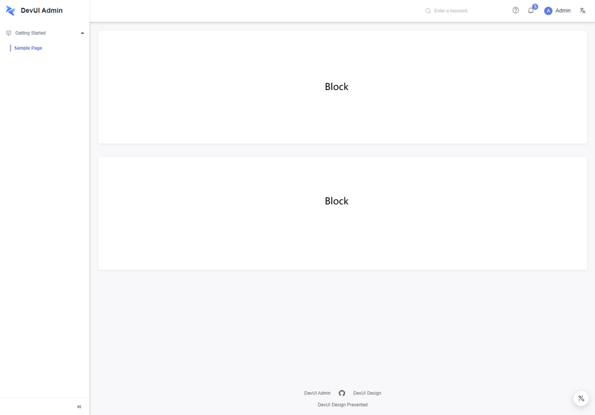

# Overview

In `Admin`, the lower layer of the outer project frame is our page. Each page of the sample pages provided by `Admin` can be divided into one or more blocks. The blocks provided on the sample pages are divided and aggregated to form a block library. With the current block library, you can select the blocks you want to build pages, further improving page building efficiency. All chunks can be extended at the code level, so you can customize them to the maximum extent you can once you use them.

More, we now support the use of `Admin Cli` for chunks. With `Admin Cli`, you can create projects, add pages, and add chunks in just a few simple steps.

# Block Design

Currently, a block is designed in a module division manner. A block is a module, and each block has integrity. As you use them, you can use them as modules, and the block code will be added to your project, which you can customize and extend at the code level.

# CLI tool

Based on `Angular Schematics`, we have implemented a set of cli for `DevUI Admin` to help you quickly build an Admin project using the blocks we provide. After you initialize the project by `ng add ng-devui-admin`, You will be able to insert chunks and build a page from chunks using the commands `ng g ng-devui-admin:blocks` and `ng g ng-devui-admin:views` we provide. For more use, see the document [Using Blocks](/admin-materials/docs/use-materials).

# Feature path

For `Admin`, after block splitting, we have completed the structure hierarchy from the outer frame granularity to the internal pages, blocks, and components. In this way, the project and different pages can be constructed by assembling structures of different granularities.
Currently, we have gradually enriched blocks and components. In the next step, we will make more attempts at the outer frame level to allow them to have more visual and functional customization space. Currently, Admin Cli is provided for project creation and use of blocks. In the next step, we will make more attempts to make the entire project construction faster and more intuitive.

# Next

[Using Blocks](/admin-materials/docs/use-materials)

[Blocks Overview](/admin-materials/overview)
