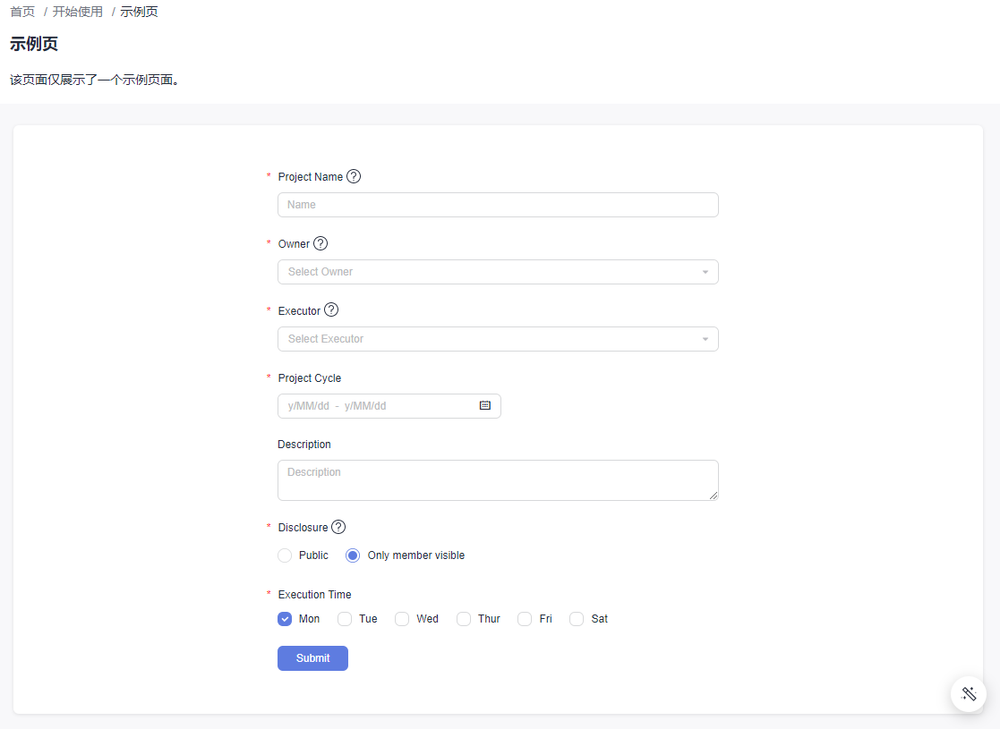

# 使用区块

如果你使用 `ng-add` 添加我们的 `DevUI Admin` 项目，那么你可以通过 Angular CLI 快速的搭建一个 `Admin` 项目。该网站主要是为了方便你查看我们目前所有的区块，更多的 `admin` 区块的使用请参考 [DevUI Admin](https://devui.design/admin-page/docs/use-block)

## 添加区块

在添加区块之前请先安装 `ng-devui-materials` (后续的版本中我们将自动为你安装该依赖)。

```bash
npm i ng-devui-materials
```

安装完成之后就可以通过我们提供的 cli 命令来帮你添加区块了。

```bash
ng g ng-devui-admin:blocks --block-name BlockName
```

- 进入到你需要添加区块的页面 (此处假设你已经通过 `ng-add` 初始化了项目)

```bash
cd src/app/pages/getting-started/sample
```

- 在该路径下通过命令行添加你想要的区块

```bash
ng g ng-devui-admin:blocks --block-name BasicForm
# 你也可以不指定区块的名字，在之后的交互中输入区块名即可（注意名字为大驼峰命名或中划线连接）
ng g ng-devui-admin:blocks
```

在插入区块的时候有两种方式：`Insert Source Code` 和 `Insert Module`。

**推荐使用 `Insert Module` 的模式，这样将会更利于你的代码组织结构。**




## 基于区块创建页面

除了在已有的页面中插入区块，我们还提供了你也可以新建一个页面，并且使用我们的区块来搭建你的新页面。

```bash
ng g ng-devui-admin:views --view-name view-name
```

同样的我们在插入区块时也有上述的两种方式，同样推荐通过 `Insert Module` 的形式引入。

- 进入到你需要添加页面的模块 (此处假设你已经通过 `ng-add` 初始化了项目)

```bash
cd src/app/pages/getting-started
```

- 在该路径下添加新页面

```bash
ng g ng-devui-admin:views
```


添加区块的同时可以同时输入多个区块，使用空格分隔即可。

我们会为你的新页面添加你所需要的区块，并且配置好相关的路由(默认我们会将路由添加到根目录下)，如果添加的路由层级不符合你的要求，可以自行到 `src/app/pages/pages.component.ts` 下修改 `updateMenu` 方法。

```typescript
updateMenu() {
  this.menu = [
    {
      title: '开始使用',
      open: true,
      children: [
        {
          title: '示例页',
          link: '/pages/getting-started/sample',
        },
      ],
      link: '/pages/getting-started',
      menuIcon: 'icon icon-console',
    },
  ]
}
```


默认的我们新增的区块是铺满的，如果你需要更改布局，可以参考 [布局](/admin-page/docs/layout) 中 `响应式布局` 进行更改。

## 使用区块搭建特性模块

如果你想新建一个自己的特性模块并且在其中创建诸多页面并通过我们提供的区块进行搭建，可以参考以下步骤：

- 参考 [新增页面](/admin-page/docs/new-page) 添加特性模块并且设置好路由。（可以忽略其中的 `新增component` 一步，因为我们将在此通过 CLI 创建基于我们模块的页面）

- 在新建的特性模块下新增一个基于我们区块的页面

```bash
cd src/app/pages/customers
ng g ng-devui-admin:views
# 创建页面之后我们会自动为你设置好路由
```


## 使用 `Page Title` 区块

如果你使用了 `page title` 区块，那么在代码插入之后你还需要手动调整代码的位置如下所示

```html
<!-- page title 应该放在最上层 -->
<da-page-title></da-page-title>
<div class="da-content-wrapper">......</div>
```
