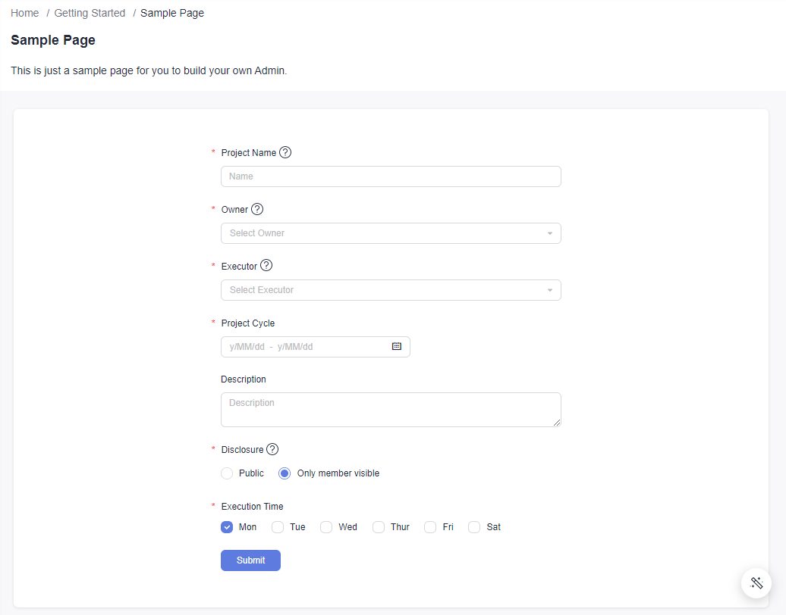
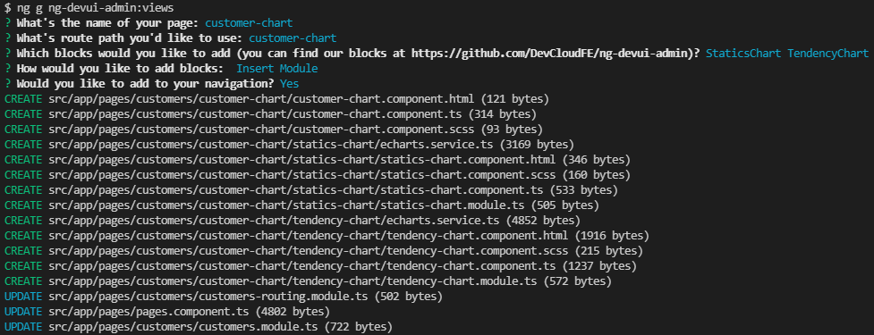

# Using Blocks

If you use `ng-add` to create our `DevUI Admin` project, you can quickly build an `Admin` project using the Angular CLI. The main purpose of this website is searching our materials. For more information, you could go to [DevUI Admin](https://devui.design/admin-page/docs/use-block).

## Add A Block

Install package `ng-devui-materials` before using our blocks (We will install this package in our future version).

```bash
npm i ng-devui-materials
```

After you finish install `ng-devui-materials`, you are good to use our cli to add blocks.

```bash
ng g ng-devui-admin:blocks --block-name BlockName
```

- Go to the page where you need to add a block (This assumes that you have initialized the project with `ng-add`).

```bash
cd src/app/pages/getting-started/sample
```

- Add the blocks you want from the command line in this path.

```bash
ng g ng-devui-admin:blocks --block-name BasicForm
# You do not need to specify the block name, but enter the block name in the subsequent interaction. (Note that the name is a large hump or a hyphen connection.)
ng g ng-devui-admin:blocks
```

There are two ways to insert a block: `Insert Source Code` and `Insert Module`.

**The `Insert Module` pattern is recommended to help your code structure.**




## Create a page based on a block

In addition to inserting blocks into existing pages, we also provide you with the ability to create a new page and use our blocks to build your new page.

```bash
ng g ng-devui-admin:views --view-name view-name
```

We also use the preceding two methods to insert a block. It is also recommended that the Insert Module form be used to insert a block.

- Go to the module where you want to add the page (This assumes that you have initialized the project with `ng-add`).

```bash
cd src/app/pages/getting-started
```

- Add a new page under this path

```bash
ng g ng-devui-admin:views
```


When adding a block, you can enter multiple blocks at the same time and separate them with spaces.

We will add the required blocks to your new page, and set the relevant routes(By default, we will add the route to the root level), If the added route is not what you expected, you can modify it in `src/app/pages/pages.component.ts`, then modify function `updateMenu`.

```typescript
updateMenu() {
  this.menu = [
    {
      title: 'GettingStarted',
      open: true,
      children: [
        {
          title: 'Sample',
          link: '/pages/getting-started/sample',
        },
      ],
      link: '/pages/getting-started',
      menuIcon: 'icon icon-console',
    },
  ]
}
```


By default, the newly added blocks are paved. If you need to change the layout, refer to "Responsive Layout" in [Layout](/admin-page/docs/layout) to change the layout.

## Using Blocks to Build Feature Modules

If you want to create a feature module of your own and create a number of pages in it and build it using the blocks provided by us, you can follow the steps below:

- Add feature modules and set routes by referring to [New Page](/admin-page/docs/new-page). (You can ignore the `Adding a component file` step, as we'll create a page based on our module from the CLI here)

- A new page based on our block is added under the new feature module.

```bash
cd src/app/pages/customers
ng g ng-devui-admin:views
# We will set the route for you after creating the page automatically
```




## Using `Page Title` Block

If you are using `page title` block, adjust the inserted code to the top of your html.

```html
<!-- page-title should at the very top of your html -->
<da-page-title></da-page-title>
<div class="da-content-wrapper">......</div>
```
